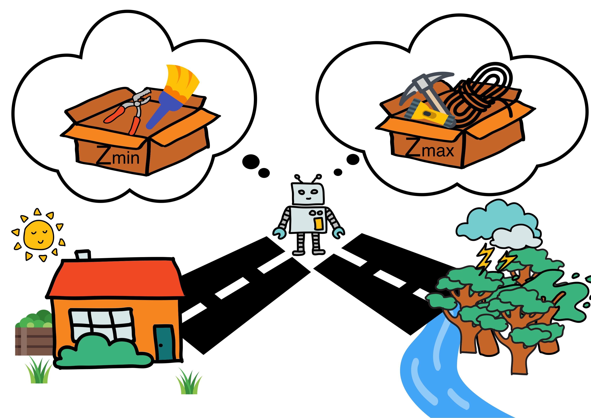
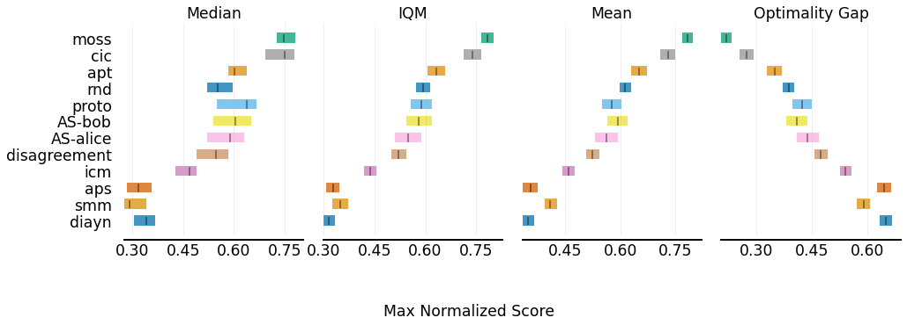

# Mixture Of SurpriseS (MOSS)
This repo contains the official [**Jax/Haiku**](https://github.com/google/jax) code for A Mixture Of Surprises for Unsupervised Reinforcement Learning. [[arxiv]](https://arxiv.org/abs/2210.06702)

## Introduction



We investigated a method that uses mixture of skills to alleviate the assumptions needed on the environment for unsupervised reinforcement learning. 

## Results

[RLiable](https://github.com/google-research/rliable) Aggregated Results on the [Unsupervised Reinforcement Learning Benchmark](https://github.com/rll-research/url_benchmark)



## Numerical Results

| Domain                                             |                 | Walker          |                |                |                 | Quadruped      |                 |                 |                | Jaco            |                |
|----------------------------------------------------|-----------------|-----------------|----------------|----------------|-----------------|----------------|-----------------|-----------------|----------------|-----------------|----------------|
| Method\Task | Flip            | Run             | Stand          | Walk           | Jump            | Run            | Stand           | Walk            | Bottom Left    | Bottom Right    | Top Left       |
| ICM                   | 381±10          | 180±15          | 868±30         | 568±38         | 337±18          | 221±14         | 452±15          | 234±18          | 112±7          | 94±5            | 90±6           |
| Disagreement | 313±8           | 166±9           | 658±33         | 453±37         | 512±14          | 395±12         | 686±30          | 358±25          | 120±7          | 132±5           | 111±10         |
| RND                   | 412±18          | 267±18          | 842±19         | 694±26         | **681±11** | 455±7          | 875±25          | 581±42          | 106±6          | 111±6           | 83±7           |
| ICM APT              | 596±24          | 491±18          | 949±3          | 850±22         | 508±44          | 390±24         | 676±44          | 464±52          | 114±5          | 120±3           | 116±4          |
| IND APT            | 576±20          | 467±21          | 947±4          | 888±19         | 542±34          | 328±18         | 605±32          | 367±24          | 126±5          | 131±4           | 109±6          |
| Proto            | 378±4           | 225±16          | 828±24         | 610±40         | 426±32          | 310±22         | 702±59          | 348±55          | 130±12         | 131±11          | 134±12         |
| AS-Bob                          | 475±16          | 247±23          | 917±36         | 675±21         | 449±24          | 285±23         | 594±37          | 353±39          | 116±21         | **166±12** | 143±12         |
| AS-Alice                        | 491±20          | 211±9           | 868±47         | 655±36         | 415±20          | 296±18         | 590±41          | 337±17          | 109±20         | 141±19          | 140±17         |
| SMM                     | 428±8           | 345±31          | 924±9          | 731±43         | 271±35          | 222±23         | 388±51          | 167±20          | 52±5           | 55±2            | 53±2           |
| DIAYN                | 306±12          | 146±7           | 631±46         | 394±22         | 491±38          | 325±21         | 662±38          | 273±19          | 35±5           | 35±6            | 23±3           |
| APS                    | 355±18          | 166±15          | 667±56         | 500±40         | 283±22          | 206±16         | 379±31          | 192±17          | 61±6           | 79±12           | 51±5           |
| CIC                    | 715±40          | **535±25** | **968±2** | 914±12         | 541±31          | 376±19         | 717±46          | 460±36          | 147±8          | 150±6           | 145±9          |
| MOSS (Ours)                       | **729±40** | 531±20          | 962±3          | **942±5** | 674±11          | **485±6** | **911±11** | **635±36** | **151±5** | 150±5           | **150±5** |


## Get Started
### Pretraining
```
# example for pretraining on the jaco domain
python pretrain_multimodal.py \
  reward_free=true \
  agent=ddpg_multimodal_skill_torch \
  agent.skill_mode=sign \
  agent.partitions=1.5 \
  agent.skills_cfg.update_skill_every=50 \
  intrinsic=multimodal_cic \
  intrinsic.temperature=0.5 \
  intrinsic.network_cfg.skill_dim=64\
  intrinsic.knn_entropy_config.minus_mean=true \
  benchmark=dmc \
  benchmark.task=jaco_reach_top_left \
  seed=0 \
  wandb_note=moss_pretrain_base_sign
```
### Finetuning
```
# example for finetuning on the jaco domain
python finetune_multimodal.py \
    reward_free=false \
    agent=ddpg_multimodal_skill_torch \
    intrinsic.network_cfg.skill_dim=64 \
    agent.search_mode=constant \
    benchmark=dmc \
    benchmark.task=jaco_reach_top_left \
    seed=0 \
    checkpoint=../../../../is_pretrain_True/jaco_reach_top_left/0/moss_pretrain_base_sign/checkpoints/2000000.pth \
    num_finetune_frames=100000 \
    wandb_note=moss_finetune_base_sign
```

## Contact

If you have any question, please feel free to contact the authors. Andrew Zhao: [zqc21@mails.tsinghua.edu.cn](mailto:zqc21@mails.tsinghua.edu.cn).

## Acknowledgment

Our code is based on [Contrastive Intrinsic Control](https://github.com/rll-research/cic) and [URL Benchmark](https://github.com/rll-research/url_benchmark).

## Citation

If you find our work is useful in your research, please consider citing:

```bibtex
@article{zhao2022mixture,
  title={A Mixture of Surprises for Unsupervised Reinforcement Learning},
  author={Zhao, Andrew and Lin, Matthieu Gaetan and Li, Yangguang and Liu, Yong-Jin and Huang, Gao},
  journal={arXiv preprint arXiv:2210.06702},
  year={2022}
}
```